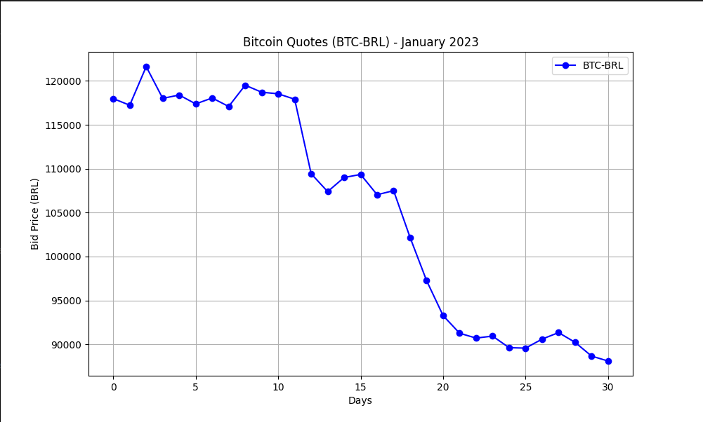

# Bitcoin Price Visualization

This project retrieves and visualizes Bitcoin (BTC) price data in Brazilian Real (BRL) using the `economia.awesomeapi.com.br` API. It fetches daily BTC-BRL exchange rates within a specified date range and displays the prices in a graphical format using `matplotlib`.



## Prerequisites

Before running the project, ensure you have the following installed:

- Python 3.x
- `requests` library (install using `pip install requests`)
- `matplotlib` library (install using `pip install matplotlib`)

## Getting Started

Follow these steps to run the project locally:

1. **Clone the repository:**

   ```bash
   https://github.com/Alves0611/bitcoin-price-visualization.git

2. **Navigate to the project directory:**
  cd bitcoin-price-visualization

3. **Run the Python script:** 
  python main.py

## Configuration

- Adjust the date range:
  -  Modify start_date and end_date variables in bitcoin.py to fetch data for a different time period.